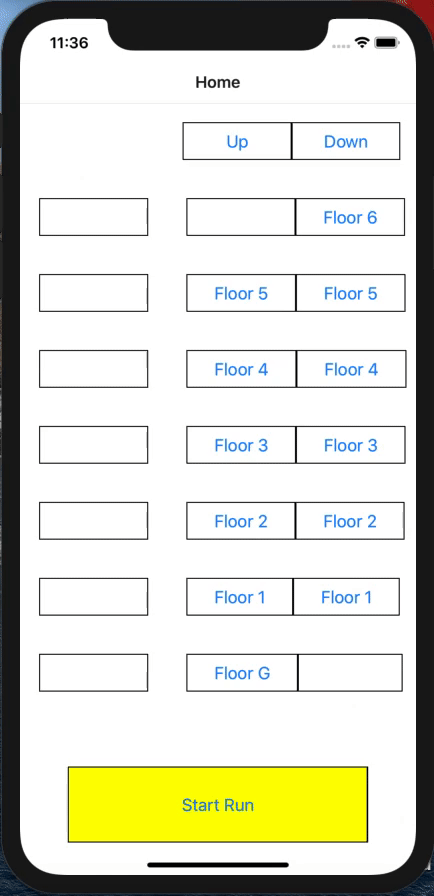

# Lift Program using React-Native & Redux
A simple lift/elevator program using react-native and redux

## Demo

## Usage
1. npm install
2. cd ios && pod install && cd ..
3. npx react-native run-ios

## Packages Used
1. React Native 
2. Redux
3. React Navigation
4. Styled System
5. Styled Components

## Improvements
1. Floor button can be clicked only once to improve performance
2. Better execution logic 

